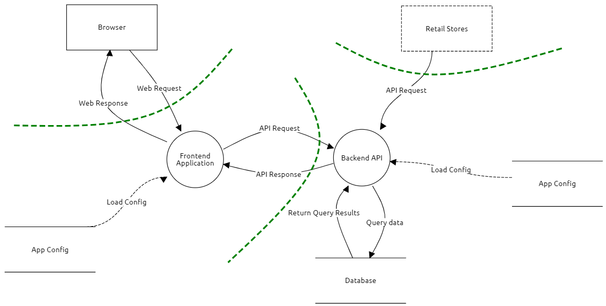

# Anforderungsspezifikationen

## Einführung

### Zweck

Dieses Dokument gibt einen groben Überblick über das Produkt CapWatch, sowie die geplanten Anforderungen, die es erfüllen muss und solche die optional noch umgesetzt werden können.

### Gültigkeitsbereich

Dieses Dokument ist gültig für das Engineering Projekt im Frühlingssemester 2021 an der Fachhochschule OST. Es ist für die Betreuer und Entwickler dieses Projektes ausgelegt.

### Referenzen

[ISO/IEC 9126](https://de.wikipedia.org/wiki/ISO/IEC_9126)

[OWASP Threat Modeling](https://owasp.org/www-community/Threat_Modeling)

### Übersicht

Im Abschnitt "Allgemeine Beschreibung" werden allgemeine Informationen zum Produkt erläutert. Anschliessend werden im Abschnitt "Funktionale Anforderungen" die geplanten Funktionalitäten beschrieben. Im letzten Abschnitt werden die nicht Funktionalen Anforderungen genauer umschrieben und nicht kategorisierbare Themen zusammengefasst.

## Allgemeine Beschreibung

### Produkt Perspektive

Im Zuge der Corona Pandemie ist es plötzlich an sehr vielen Orten zu Einschränkungen der erlaubten Anzahl Personen innerhalb eines definierten Bereichs gekommen. Das führte dazu, dass man einkaufen gehen wollte und die Eintrittsbegrenzungssystem auf Rot (Eintritt verweigert) war. Dadurch war man gezwungen zu warten und hat Zeit verloren. Dieses Problem kann gemindert werden, indem man sich zuhause im Voraus darüber informieren kann, ob es gerade ein guter Zeitpunkt ist, einkaufen zu gehen. Da die Systeme zur Personenzählung nun fest installiert sind, ist es gut möglich, dass sie auch in Zukunft bleiben werden. Hier setzt unser Produkt an, indem es die ganzen gesammelten Daten konsolidiert und auf einer einfachen Benutzeroberfläche abrufbar macht. Dies hilft sowohl den Geschäften, wie auch den Konsumenten.

### Produkt Funktion

CapWatch ist dazu da, um als Kunde einen einfachen Überblick zu bekommen wie viele Personen sich aktuell in einem Laden, Restaurant oder einer Sauna aufhalten. Da die Firmen aktuell gezwungen sind, das Besucheraufkommen zu erfassen und zu steuern, wollen wir diese Daten bündeln und somit den Kunden die Möglichkeit geben, das eigene Verhalten anzupassen und so unnötige Wartezeiten zu vermeiden.

### Benutzer Charakteristik

Jede Person die eine Einrichtung mit Personenbeschränkung besuchen möchte und sich im Voraus über das Besucheraufkommen informieren will.

### Einschränkungen

In der Grundausführung ist unser Produkt nur eine Zusammenfassung der vorhandenen Daten, welche in einer Übersicht angezeigt werden können. Die von den Firmen angelieferten Daten werden nicht ausgewertet. Es sind jeweils nur die aktuellsten Daten einsehbar. Bei den Kunden werden die Favoriten lokal im Browser gespeichert.

### Annahmen

Wir gehen davon aus, dass die Firmen uns die gesammelten Daten zur Verfügung stellen werden und dass sie die Daten in einer Art erfassen, die es uns erlaubt sie weiterzuverarbeiten. Im Rahmen des Projektes werden wir nur mit Testdaten arbeiten, um externe Abhängigkeiten zu vermeiden.

### Abhängigkeiten

Wir sind von Firmen abhängig, die uns aktuelle Daten liefern wollen und können.

## Funktionale Anforderungen

Wir haben uns aufgrund des einfachen Geschäftsfalles dagegen entschieden Use Cases einzusetzen, da diese einen hohen Mehraufwand mit sich bringen würden. Wir setzen dafür auf einen schlanken Mix aus User Stories und MUSS/KANN Anforderungen.

### Anlieferer / Anbieter

***Als Anlieferer möchte ich mich registrieren können, damit ich den Konsumenten die aktuellen Besucherzahlen liefern kann.***

```eval_rst
+-----------------+-----------+--------------------------------------+
| Anforderungs-ID | Kategorie | Beschreibung                         |
+=================+===========+======================================+
| AL-1            | MUSS      | Der Anlieferer liefert regelmässig   |
|                 |           | die aktuelle Auslastung mit Secret,  |
|                 |           | Timestamp und Maximal erlaubter      |
|                 |           | Auslastung an.                       |
+-----------------+-----------+--------------------------------------+
| AL-2            | KANN      | Der Anlieferer kann sich per Request |
|                 |           | registrieren, indem er Firmenname,   |
|                 |           | Ortschaft und ein optionales Logo    |
|                 |           | als Attachment mitschickt. Er erhält |
|                 |           | als Antwort ein Secret oder eine     |
|                 |           | Fehlermeldung.                       |
+-----------------+-----------+--------------------------------------+
```

### Konsument

***Als Konsument möchte ich mich über das aktuelle Besuchsaufkommen informieren können.***

```eval_rst
+-----------------+-----------+--------------------------------------+
| Anforderungs-ID | Kategorie | Beschreibung                         |
+=================+===========+======================================+
| AW-1            | MUSS      | Als Konsument kann ich eine Liste    |
|                 |           | aller verfügbaren Firmen anzeigen    |
|                 |           | lassen.                              |
+-----------------+-----------+--------------------------------------+
| AW-2            | MUSS      | Als Konsument kann ich nach einer    |
|                 |           | Firma suchen.                        |
+-----------------+-----------+--------------------------------------+
| AW-3            | MUSS      | Als Konsument kann ich eine Firma    |
|                 |           | als Favorit markieren. Favoriten     |
|                 |           | können in der Favoritenansicht       |
|                 |           | angezeigt werden.                    |
+-----------------+-----------+--------------------------------------+
| AW-4            | KANN      | Als Konsument kann ich mir eine      |
|                 |           | Liste von Geschäften in meiner       |
|                 |           | Umgebung nach Distanz sortiert       |
|                 |           | anzeigen lassen.                     |
+-----------------+-----------+--------------------------------------+
| AW-5            | KANN      | Ich kann mich als Konsument          |
|                 |           | registrieren und anschliessend nach  |
|                 |           | einem Login über mehrere Geräte      |
|                 |           | hinweg auf meine Favoriten           |
|                 |           | zugreifen.                           |
+-----------------+-----------+--------------------------------------+
| AW-6            | KANN      | Als Konsument kann ich meine         |
|                 |           | E-Mailadresse hinterlegen und mich   |
|                 |           | so über wichtige Ereignisse          |
|                 |           | informieren lassen.                  |
+-----------------+-----------+--------------------------------------+
| AW-7            | KANN      | Als Konsument kann ich über eine     |
|                 |           | Detailansicht einer Firma die        |
|                 |           | Prognosen und Verläufe des           |
|                 |           | Besucheraufkommens anzeigen lassen.  |
+-----------------+-----------+--------------------------------------+
| AW-8            | KANN      | Als Konsument kann ich mir bei einer |
|                 |           | Firma einen begrenzten Zeitraum      |
|                 |           | reservieren.                         |
+-----------------+-----------+--------------------------------------+
```

Für das Minimal Viable Product (MVP) sind die MUSS-Anforderungen relevant. Falls Kapazität vorhanden ist, können aber auch noch KANN-Anforderungen umgesetzt werden. Es ist möglich, dass nicht alle KANN-Anforderungen umgesetzt werden können.

## Weitere Anforderungen

### Threat Model nach OWASP



Da wir neben dem Engineering-Projekt gerade das Modul Secure Software besuchen, bot es sich zu Übungszwecken an ein Threat Model für CapWatch zu erstellen. Dieses Threat Model hilft um das Produkt bestmöglich gegen Gefahren von ausserhalb abzusichern. Es wird laufend aktualisiert und es können neue nicht Funktionale Anforderungen daraus entstehen. Hierzu machen wir uns Gedanken zu folgenden Punkten:

- **Was sind unsere Assets:** In unserem MVP sind in unserem System nur Daten vorhanden die uneingeschränkt über unsere Webseite einsehbar sind. In der Datenbank sind nur regelmässigen Einträge mit Timestamp, Anzahl Personen  und maximal erlaubter Anzahl Personen vorhanden. Diese Metriken sind völlig anonym und werden als Zahlen angeliefert, Rückschlüsse auf einzelne Personen sind unmöglich. Zusätzlich speichern wir noch die Secrets der Firmen, die uns Daten anliefern. Diese Daten sind schützenswert, da es als Angreifer mit dem Secret möglich wäre unser System zu überlasten. In der späteren Ausbaustufe, in der wir Kundendaten erfassen und speichern, ist die Datenbank mit Kundendaten ein wichtiges Asset.

- **Threat Agents und mögliche Angriffe:** Interne Angriffe können die Kundendaten abgreifen um die gespeicherten E-Mailadressen weiterzuverwenden. Dies wäre möglich über einen Zugriff auf die Kundendatenbank, die nicht genügend gut per Zugriffsrechte abgesichert worden ist. Ein externer Angreifer, welcher eine Organisierte Verbrecherbande oder ein einzelner Hacker sein kann, müsste sich die Zugangsdaten der Datenbank beschaffen um direkt darauf zuzugreifen oder er schafft es über die API an mehr Daten als eigentlich vorgesehen zu kommen.

- **Mögliche Schwachstellen:** Bei der Entwicklung unseres Produktes können mehrere Schwachstellen entstehen. Dazu gehören unsauber aufgesetzte Berechtigungen, fehlende Inputsäuberung und Inputvalidierung, überdimensionierte Schnittstellen mit zu vielen Feldern sowie schwache Passwörter und fehlende Passwortverwaltung.

- **Gegenmassnahmen:** Den internen Angriff kann man mit einem Berechtigungsmodell, welches nach dem Prinzip so wenig wie nötig aufgesetzt ist, mitigieren. Den Zugriff auf eine Kundendatenbank wird über einen Supportuser gelöst, welcher nur mit Begründung und Dokumentation der Tätigkeiten benutzt werden kann. Um die externen Angriffe zu erschweren kommen sichere Passwörter und klar definierte Schnittstellen zum Einsatz. Die Schnittstellen dürfen nur die klar definierten Felder verwenden und der Inhalt der Anfragen wird vor der Verarbeitung gesäubert um unerwünschte Effekte zu vermeiden.

### Qualitätsmerkmale

Die Nicht Funktionalen Anforderungen, aufgeteilt in MUSS und KANN Anforderungen, werden im folgenden Abschnitt aufgelistet. Die Auflistung ist nicht abschliessend und wird ständig den aktuellen Gegebenheiten angepasst.

```eval_rst
+-----------------+-----------+--------------------------------------+
| Anforderungs-ID | Kategorie | Beschreibung                         |
+=================+===========+======================================+
| NF-1            | KANN      | In Benutzerumfragen wollen wir eine  |
|                 |           | durchschnittliche Bewertung von      |
|                 |           | mindestens 4 von 5 Sternen erreichen |
|                 |           | in den Punkten: Attraktivität,       |
|                 |           | Bedienbarkeit, Erlernbarkeit und     |
|                 |           | Verständlichkeit                     |
+-----------------+-----------+--------------------------------------+
| NF-2            | MUSS      | Der Kunde soll innerhalb von einer   |
|                 |           | Sekunde das Resultat einer Abfrage   |
|                 |           | zur Verfügung haben.                 |
+-----------------+-----------+--------------------------------------+
| NF-3            | MUSS      | Unser Produkt ist unter einer Last   |
|                 |           | von 100 Anfragen pro Sekunde noch    |
|                 |           | schnell genug, dass man aus          |
|                 |           | Kundensicht keine Einschränkungen    |
|                 |           | bemerkt.                             |
+-----------------+-----------+--------------------------------------+
| NF-4            | MUSS      | Wir stellen die Anforderungen des    |
|                 |           | Datenschutzgesetzes (DSG) sicher.    |
+-----------------+-----------+--------------------------------------+
| NF-5            | MUSS      | Die häufigsten Angriffspunkte und    |
|                 |           | Schwachstellen nach OWASP werden     |
|                 |           | berücksichtigt.                      |
+-----------------+-----------+--------------------------------------+
| NF-6            | KANN      | Ein mit dem Projekt nicht            |
|                 |           | vertrauter, erfahrener Entwickler    |
|                 |           | sollte bei einem einfach Problem     |
|                 |           | innerhalb von 15min die betroffene   |
|                 |           | Codestelle gefunden haben.           |
+-----------------+-----------+--------------------------------------+
| NF-7            | KANN      | Die Ergebnisse sollte nicht älter    |
|                 |           | als 15min sein.                      |
+-----------------+-----------+--------------------------------------+
```

### Schnittstellen

Im Dokument bzw. Bereich "API Dokumentation" gibt es noch eine genaue Beschreibung der Schnittstellen.

- **Webapplikation**
    - Schnittstelle zum Backend um Besucherdaten abzufragen (1. Schritt)
    - Schnittstelle zum Backend für Authentifizierung und Autorisierung (2. Schritt)

- **Backend**
    - Schnittstelle zum Frontend um Besucherdaten zu liefern (1. Schritt)
    - Schnittstelle zum Datenbank um Daten abzulegen und zu lesen (1. Schritt)
    - Schnittstelle um Daten von den Firmen anliefern auszulassen (1. Schritt)
    - Schnittstelle um die Firmenregistrierung zu ermöglichen (2. Schritt)
    - Schnittstelle zum Frontend für die Authentifizierung und Autorisierung (2. Schritt)

- **Datenbank**
    - Schnittstelle zu Backend um Daten entgegenzunehmen oder zu liefern

### Screendesigns

Wir haben direkt Screendesigns entwickelt, weil ein Grobdesign (z.B. Wireframes) für solch einen kleinen Funktionsumfang nicht optimal ist und nur einen unnötigen Mehraufwand bedeuten würde.
Unsere Plattform wird Mobile First entwickelt, weil wir viel mehr Benutzer unterwegs bzw. auf ihrem Mobiltelefon erwarten.

Nur die Startpage auf Mobile ist relevant für das Minimum Viable Product.

Alle Screendesigns werden unter [diesem Link in Figma](https://www.figma.com/file/0vTe4KLJXtXvXXM7i5plLx/CapWatch?node-id=0%3A1) produziert und abgelegt.

### Randbedingungen

Wir sind abhängig von der Serverinfrastruktur der Ost. Wir haben keinen Einfluss auf diese und vertrauen darauf, dass sie uns ohne längere Unterbrüche und vor allem bei der Präsentation zur Verfügung steht.

Ansonsten gibt es keine Randbedingungen.
