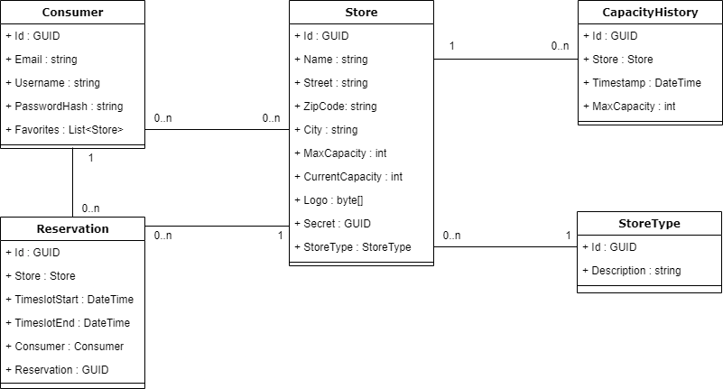

# Domainanalyse

## Einführung

### Zweck

Dieses Projekt gibt eine Übersicht über die Domain des Projektes CapWatch.

### Gültigkeitsbereich

Dieses Dokument ist gültig für das Engineering Projekt CapWatch, welches im Frühlingssemester 2021 an der Fachhochschule OST Rapperswil-Jona durchgeführt wurde. Es ist für die Betreuer und Entwickler des Projekts ausgelegt.

## Domain Modell

### Strukturdiagramm

Da C# bereits als Backendtechnologie festgelegt wurde, werden im Domain Model technologiespezifische Datentypen verwendet.

### Wichtige Konzepte

#### Store

Store ist die einzige Klasse, welche für den MVP relevant ist. In dieser Klasse sind Name, Adresse und Logo enthalten, sowie die aktuelle/maximale Auslastung. Die Applikation unterstützt nur Stores in der Schweiz.

#### Consumer

Die Klasse Consumer wird für das Login und das Speichern von Favoriten des Konsumenten verwendet.

#### CapacityHistory

Um die erwartete und durchschnittliche Auslastung zu berechnen, wird die Auslastung mit einem Zeitstempel als Verlauf abgelegt.

#### Reservation

Der Konsument kann sich bei einem Store ein Zeitfenster reservieren und erhält dafür eine Reservations-ID.

## Systemsequenzdiagramme

Die aktuell geplanten Funktionalitäten sind einfach im Aufbau, Systemsequenzdiagramme bringen daher keinen Mehrwert. Aus diesem Grund werden sie in dieser Dokumentation bewusst weggelassen.
