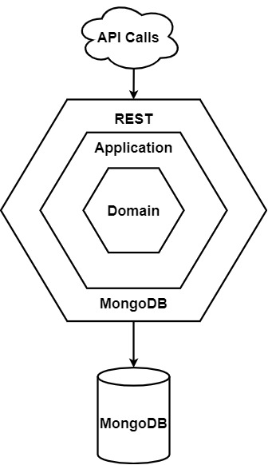

# Softwarearchitektur

## Einführung
    
### Zweck

Dieses Dokument dient als Übersicht über die Architektur des Softwareprojekts CapWatch. 

### Gültigkeitsbereich

Dieses Dokument ist gültig für das Engineering Projekt im Frühlingssemester 2021 an der Fachhochschule OST. Es ist für die Betreuer und Entwickler dieses Projektes ausgelegt.

### Übersicht

Zunächst wird eine Grobübersicht über das Gesamtsystem gegeben. Danach werden unsere Überlegungen zur gewählten Architektur dargestellt. Abschliessend werden auf die einzelnen Subsysteme, das Deployment und die Datenspeicherung im Detail eingegangen.

## Systemübersicht

Das Gesamtsystem besteht aus einer MongoDB Datenbankinstanz, einem C# Backend welches über eine REST-Schnittstelle mit dem React Frontend und externen Systemen kommuniziert.

Das Backend ist nach hexagonaler Architektur konzipiert. Hierbei steht die Domain im Zentrum und beinhaltet die Entitäten um welche sich das System dreht. Darum herum liegt die Application welche die Businesslogik beinhaltet und Interfaces definiert welche von den umliegenden Schichten implementiert und genutzt werden. Ausserhalb ist auf der einen Seite die Datenbankanbindung unserer MongoDB Instanz welche die CRUD Operationen implementiert und auf der anderen Seite die REST API welche die nötigen Web-Schnittstellen zur Verfügung stellt.

## Architekturdetails

Wir haben uns dazu entschieden keine Designklassendiagramme zu zeichnen, da diese uns gegenüber dem Strukturdiagramm im Domain Modell keinen Mehrwert bringen.

Die näheren Details zur Architektur werden in den kommenden Wochen ausgearbeitet und stehen zu diesem Zeitpunkt noch nicht zur Verfügung. Ebenfalls wird unser Entscheidungsprozess bezüglich der gewählten Architektur noch näher beschrieben.

## Deployment

Die Software wird auf einen einzelnen Linux Server deployt. Dieser wird von der OST zur Verfügung gestellt und befindet sich im dafür vorgesehenen DMZ Netzwerk der OST. Das Deplyoment selber wird mittels Docker Containern umgesetzt, die über die Container Registry auf dem Gitlab direkt bezogen werden. Zur einfachen Verwaltung des Docker basierten Setups wird auf dem Host Docker-Compose eingesetzt. Vorerst ist ein manuelles Deployment und Updaten der Software vorgesehen. Falls es die Umstände während des Projekts später zulassen, wird das Setup um eine dann noch zu definierende Komponente für das automatische Deployment erweitert. Die Container werden jeweils ab dem Master und dem Develop Branch mittels CI Pipeline automatisch gebaut und direkt der Registry hinzugefügt.
Aufgrund der Trivialität des Setup verzichten wir in an dieser Stelle auf ein Deployment Diagramm. 
