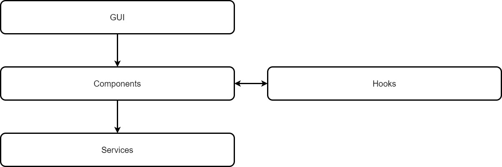
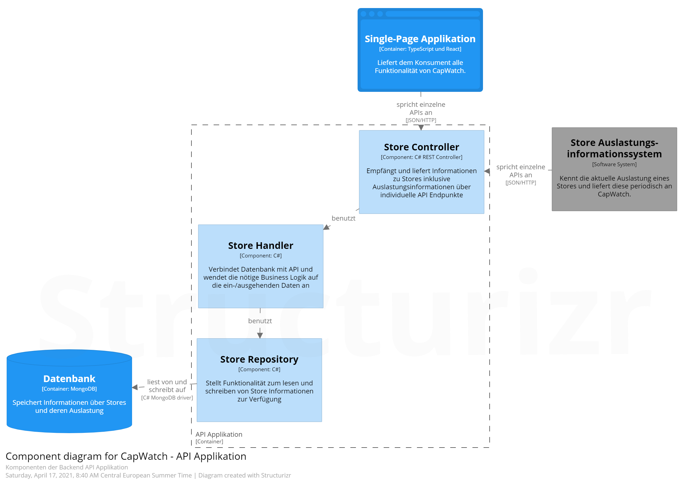
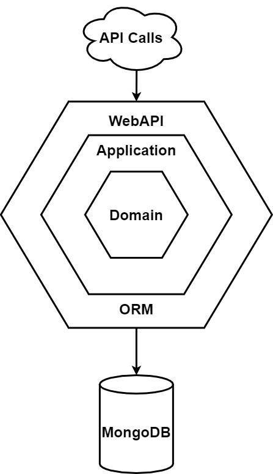
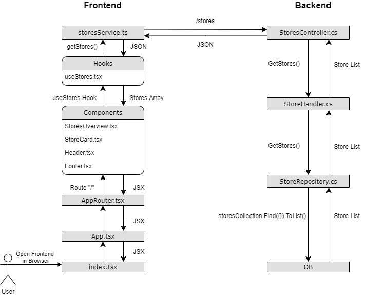

# Softwarearchitektur

## Einführung

### Zweck

Dieses Dokument dient als Übersicht über die Architektur des Softwareprojekts CapWatch.

### Gültigkeitsbereich

Dieses Dokument ist gültig für das Engineering Projekt im Frühlingssemester 2021 an der Fachhochschule OST. Es ist für die Betreuer und Entwickler dieses Projektes ausgelegt.

Diese Dokumentation kann je nach Situation dem Entwicklungsstand des Codes leicht voraus sein oder leicht hinterherhinken, da dokumentieren und entwickeln abwechslungsweise geschieht.

## Referenzen

* Die C4 Diagramme wurden mit Structurizr erstellt: https://structurizr.com/

## C4 Modell

Wir haben uns entschieden zur Visualisierung unserer Architektur das C4 Modell zu verwenden, da dieses mit übersichtlichen und einfach zu verstehenden Diagrammen sehr viel Information über ein System übermittelt. Dies hilft insbesondere Personen, die sich neu in das Projekt einlesen, sich schnell zurecht zu finden.

### System Kontext Diagramm der Software CapWatch

### Container Diagramm der Software CapWatch (*)

_(*) Das Wort Container wird hier in der Definition nach C4 Modell verwendet und und nicht im Kontext von Docker._

Das Gesamtsystem besteht aus einer MongoDB Datenbankinstanz und einem C# Backend, welches über eine REST-Schnittstelle mit dem React Frontend und externen Systemen der Stores kommuniziert.

#### Architektur Frontend

Das Frontend besteht aus einer Single-Page Applikation welche mit React in TypeScript geschrieben ist. Diese wird von einem Nginx Webserver an den Konsumenten geliefert. Das Frontend ist grob in drei Schichten unterteilt. Zuoberst befindet sich die GUI Schicht, die sich um die Darstellung der Information kümmert. Darunter befinden sich Komponenten welche die Daten für die GUI Schicht bereitstellen. Diese Daten werden von der untersten Schicht, den Services, von der Backend API abgeholt und an die Komponenten weitergeleitet.

Für React haben wir uns entschieden, da Angular unserer Meinung nach zu gross für unseren Projektumfang ist. Bei der Wahl zwischen Vue und React gewann letzteres dann, da das teaminterne Interesse and er Technologie und auch das existierende Vorwissen grösser war. Überdies ist React parallel zum Projekt auch Thema in der _Web Engineering und Design 3_ Vorlesung welche von einem Projektmitarbeiter besucht wird.

### Komponenten Diagramm der API Backend Applikation

#### Store Controller

Der Store Controller bietet klassische REST Schnittstellen an über welche Informationen zu Stores angefragt und aktualisiert werden können. Welche API Schnittstellen im Detail zur Verfügung stehen kann in der [API Dokumentation](../analyse/api-documentation.md) eingesehen werden.

#### Store Handler

Der Store Handler liegt in der Applikationsschicht und verbindet das Store Repository mit dem Store Controller. Der Handler implementiert die Business Logik, welche auf ein- und ausgehende Stores angewendet wird.

#### Store Repository

Das Store Repository wird von der Applikationsschicht definiert und vom MongoDB Adapter implementiert. Es stellt einen Satz von Standardoperationen zur Verfügung mit welchen für Stores alle benötigten CRUD Operationen durchgeführt werden können.

#### Architektur Backend

Das Backend ist nach hexagonaler Architektur in C# konzipiert. Hierbei steht die Domain im Zentrum und beinhaltet die Entitäten, um welche sich das System dreht. Nach der Domainschicht liegt die Application, welche die Businesslogik beinhaltet und Interfaces definiert, welche von den umliegenden Schichten implementiert und genutzt werden.
Ganz aussen ist auf der einen Seite ein Adapter für die Datenbankanbindung unserer MongoDB Instanz, welche die CRUD Operationen mithilfe eines ORM implementiert. Auf der anderen Seite die REST API, welche die nötigen Web-Schnittstellen zur Verfügung stellt.

Unsere Entscheidung fiel auf C#, da der Mehrheit des Teams die Technologie besser liegt als Java. Dazu kommt, dass unser Architekt aus seiner Berufstätigkeit viel Wissen in dieser Technologie, insbesondere im Bezug auf Web API Applikationen, mitbringt.

Wir haben uns für eine hexagonale Architektur entschieden, da es diese sehr einfach macht Adapter auszutauschen. Die Architektur macht auch das Testen einzelner Teile der Applikation unkompliziert. Dies erleichtert es uns gute Unit Tests zu schreiben um eine hohe Softwarequalität zu erreichen. Ein weiterer Vorteil ist, dass korrekt umgesetzte hexagonale Architektur zu loser Kopplung zwischen den einzelnen Teilen der Software führt. Auch ein wichtiger Punkt war die Möglichkeit unser Wissen bezüglich Software Architektur auszuweiten.

Aufgeteilt ist der Backend Quellcode auf vier Projekte, welche den Schichten und Adaptern der Hexagonalen Architektur entsprechen:

* __CapWatchBackend.Domain__
* __CapWatchBackend.Application__
* __CapWatchBackend.DataAccess.MongoDB__
* __CapWatchBackend.WebApi__

Um sicherzustellen, dass diese Projekte nur lose gekoppelt sind, sind Klassen welche Logik implementieren von ausserhalb der Projektgrenze nur über Interfaces verfügbar. Diese werden bei Bedarf per Constructor Dependency Injection instanziert.

## Deployment

Die Software wird auf einen einzelnen Linux Server deployt. Dieser wird von der OST zur Verfügung gestellt und befindet sich im dafür vorgesehenen DMZ Netzwerk der OST. Das Deployment selber wird mittels Docker Images umgesetzt, die über die Registry auf dem Gitlab direkt bezogen werden. 
Zur einfachen Verwaltung des Docker basierten Setups wird auf dem Host Docker-Compose eingesetzt. Vorerst ist ein manuelles Deployment und Updaten der Software vorgesehen. Falls es die Umstände während des Projekts später zulassen, wird das Setup um eine dann noch zu definierende Komponente für das automatische Deployment erweitert.
Die Container werden jeweils ab dem Master- und dem Develop-Branch mittels CI Pipeline automatisch gebaut und direkt der Registry hinzugefügt.

Aufgrund der Trivialität des Setup verzichten wir in an dieser Stelle auf ein Deployment Diagramm.

## Datenspeicherung

Zur Speicherung der Daten benutzen wir MongoDB. Wir haben uns für einen NoSQL Dokumentspeicher entschieden, da CapWatch auch mit optionalen Erweiterungen kaum relationale Abhängigkeiten besitzt. Des weiteren war bereits ein Grundwissen zur Technologie vorhanden und durch die existierende sehr umfangreiche Dokumentation ist sichergestellt, dass wir bei möglichen Problemen eine gute Informationsquelle haben.

Zum aktuellen Zeitpunkt umfasst die Datenbank nur eine Collection in welcher Store Dokumente verwaltet werden. Die Felder der Dokumente entsprechen den Properties der Store Entitäten.

## Grössen und Leistung

Zum aktuellen Zeitpunkt können noch keine Aussagen zu Einschränkungen bezüglich benötigter Hardware und Leistung der Software gemacht werden.

## Ausbau-Szenario

Bezüglich Ausbau-Szenarien haben wir uns bereits bei der Erstellung der [Anforderungsspezifikation](../analyse/anforderungsspezifikation.md) Gedanken gemacht. Mögliche Erweiterungen sind in den Tabellen bei den Funktionalen Anforderungen und Qualitätsmerkmalen unter der Kategorie _KANN_ aufgeführt.

Weiter lädt das Frontend aktuell regelmässig die Liste der Stores und deren Auslastung um aktuelle Daten anzuzeigen. Hier würde sich ein Websocket anbieten, welcher dem Frontend mitteilt, falls es Änderungen gibt. Dieser Ausbau ist bereits für einen der nächsten Sprints geplant.

## Performance-Szenario

Das Frontend braucht unsererseits nur Performance bis die React Applikation einmal beim Konsumenten in den Browser geladen ist. Danach läuft diese dort als Single-Page Applikation und es ist nur noch die Performance der API relevant. Nichtsdestotrotz wird das Frontend natürlich so performant wie möglich geschrieben, damit auch Anwender mit weniger starken Systemen ein gutes Erlebnis haben. Dazu wird der Virtual DOM so sinnvoll wie möglich eingesetzt und es werden nur Komponenten gezeichnet die sich verändert haben.

Das CapWatch Backend ist zustandslos und kann somit mit geringem Aufwand mehrfach hochgefahren und die verschiedenen Instanzen mit einem Load Balancer gleichmässig bedient werden.

Falls bei der Datenbank Performance Probleme relevant werden sollten, wären die beiden möglichen Optionen Replication und Sharding. Bei der Replication werden die gesamten Daten der Datenbank auf mehreren Systemen redundant gehalten und die Anfragen werden zwischen diesen Systemen verteilt. Beim Sharding werden die Daten ebenfalls auf mehrere Systeme verteilt, allerdings ist hier auf jedem System nur ein Teil der Daten und Anfragen werden auf das jeweils richtige System geleitet. Mit diesen Lösungen haben wir noch keine Erfahrungen und wir müssten noch einiges an Wissen gewinnen, sollte dies nötig werden. Aus diesem Grund können wir auch keine Aussage dazu machen wie aufwändig das Umsetzen einer dieser beiden Lösungen wäre.

## Durchlaufene Klassen

Hier folgt noch eine grobe Übersicht über die wichtigsten Klassen / Methoden welche bei einem Aufruf der Webseite durchlaufen werden.

## Weggelassene Dokumentation

* Wir haben uns dazu entschieden keine Designklassendiagramme zu entwerfen, weil diese uns gegenüber dem Strukturdiagramm im Domainmodell keinen Mehrwert bieten.

* Wir sind bei der Dokumentation der Architektur bewusst nicht bis auf die Ebene Code (nach C4) / Klassendiagramme hinunter gegangen, da diese in den wenigsten Fällen wirklich hilfreich sind. Sollte trotzdem irgendwann ein Klassendiagramm von Nöten sein, kann dieses aus dem Code generiert werden, was dann auch garantiert, dass es die aktuellsten Informationen enthält.
