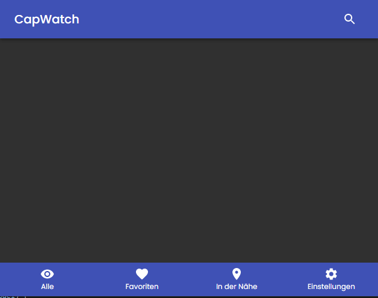
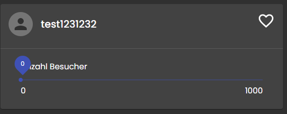
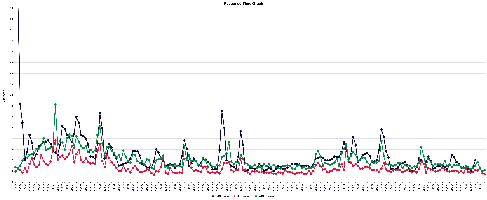

# Systemtest-Protokoll 29. April 2021

## Einführung

### Zweck

Dieses Dokument dient dazu, eine Übersicht zu geben welche Systemtests wann durchgeführt wurden und was das Resultat war.

### Gültigkeitsbereich

Dieses Dokument ist für die Stakeholder dieses Projektes, sowie die Entwickler erstellt worden. Es wurde im Rahmen des Engineering Projekts der Fachhochschule Ost erarbeitet.

### Referenzen

[Systemtestspezifikation](./systemtestspezifikation.md)

## Angaben zur Durchführung

**Testdatum:** 2021-04-29

Getestet wurde auf folgendem Stand der jeweiligen Git Repositories.

- **Frontend:** d6063e72
- **Backend:** e0fcdadf

Um den Test durchzuführen wurde in beiden Repositories über Docker-Compose die Software gestartet.

## Protokoll

```eval_rst
+----------------+---------------+--------------------------------------------------------+----------------------------------+
| Anforderung    | Implementiert | Kommentare                                             | Status                           |
+================+===============+========================================================+==================================+
| AL-1-1         | ja            |                                                        | erfüllt                          |
+----------------+---------------+--------------------------------------------------------+----------------------------------+
| AL-2-1         | ja            |                                                        | erfüllt                          |
+----------------+---------------+--------------------------------------------------------+----------------------------------+
| AL-2-2         | ja            |                                                        | erfüllt                          |
+----------------+---------------+--------------------------------------------------------+----------------------------------+
| AW-1-1         | ja            |                                                        | erfüllt                          |
+----------------+---------------+--------------------------------------------------------+----------------------------------+
| AW-1-2         | ja            |                                                        | erfüllt                          |
+----------------+---------------+--------------------------------------------------------+----------------------------------+
| AW-1-3         | ja            |                                                        | erfüllt                          |
+----------------+---------------+--------------------------------------------------------+----------------------------------+
| AW-2-1         | nein          | Wurde nicht umgesetzt, weil Umfang zu Gross            | nicht getestet                   |
+----------------+---------------+--------------------------------------------------------+----------------------------------+
| AW-3-1         | ja            |                                                        | erfüllt                          |
+----------------+---------------+--------------------------------------------------------+----------------------------------+
| AW-3-2         | ja            |                                                        | erfüllt                          |
+----------------+---------------+--------------------------------------------------------+----------------------------------+
| AW-3-3         | ja            |                                                        | erfüllt                          |
+----------------+---------------+--------------------------------------------------------+----------------------------------+
```

## Manuelle Frontend Tests



Wenn in der Liste aller Stores Daten vorhanden sind, wird in den Favoriten nicht angezeigt, dass keine Favoriten ausgewählt sind.


In der Navigation ist nicht ersichtlich, wo man sich aktuell befindet.



Wenn die Anzahl aktueller Besucher zu tief ist, überlappt der Picker den Titel.

## Test der NF-Anforderungen, Performance- und Lasttests

Soweit möglich und sinnvoll wurden die nicht funktionalen Anforderungen getestet. Das Backend wurde mit JMeter getestet. Die Ergebnisse sind mit Vorsicht zu betrachten, da nicht auf einem isolierten System getestet wurde. Trotzdem kann man sagen, dass man fürs erste nicht mit Performanceproblemen rechnen muss.

```eval_rst
+-------------+----------+--------------------+----------------+
| Anforderung | Getestet | Kommentar          | Erfüllt        |
+=============+==========+====================+================+
| NF-1        | nein     | Bis jetzt haben    | nicht getestet |
|             |          | wir noch keine     |                |
|             |          | Benutzerumfragen   |                |
|             |          | gemacht.           |                |
+-------------+----------+--------------------+----------------+
| NF-2        | ja       | Komplettes Laden   | ja             |
|             |          | der Seite mit 50   |                |
|             |          | Stores 1.15s       |                |
+-------------+----------+--------------------+----------------+
| NF-3        | ja       | Lasttest mit 100   | ja             |
|             |          | Benutzern.         |                |
|             |          | Antwortzeiten      |                |
|             |          | immer unter 50ms.  |                |
+-------------+----------+--------------------+----------------+
| NF-4        | ja       | Reaktionszeit der  | ja             |
|             |          | Seite mit 50       |                |
|             |          | Stores war schnell |                |
+-------------+----------+--------------------+----------------+
| NF-5        | nein     | Aktuell werden     | nicht getestet |
|             |          | keine DSG          |                |
|             |          | relevanten Daten   |                |
|             |          | verwaltet.         |                |
+-------------+----------+--------------------+----------------+
| NF-6        | ja       | Gefahren wurden im | 95%            |
|             |          | Threat Model neu   |                |
|             |          | evaluiert.         |                |
+-------------+----------+--------------------+----------------+
| NF-7        | nein     | Konnte nicht       | nicht getestet |
|             |          | getestet werden    |                |
+-------------+----------+--------------------+----------------+
```



## Verbesserungsmöglichkeiten

Der Umfang wurde unterschätzt und aufgrund von sehr vielen Problemen mit der CI/CD Pipeline, wurde auf eine Funktionalität verzichtet. Mit einer detaillierteren Planung wollen wir dieses Problem im nächsten Sprint vermeiden.

### Bekannte Einschränkungen

Eine MUSS-Anforderung, die Suche, wurde aus Zeitgründen erst im Backend umgesetzt und wird im nächsten Sprint im Frontend implementiert.
