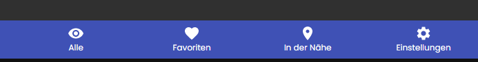
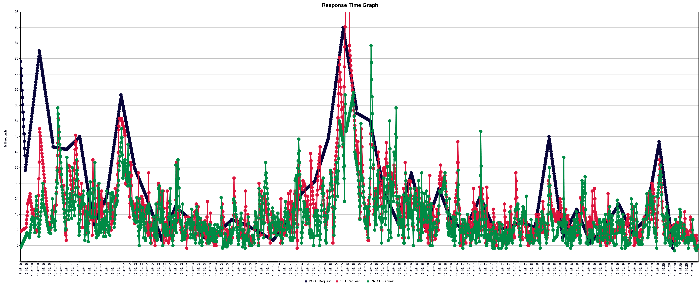

# Systemtest-Protokoll 20. Mai 2021

## Einführung

### Zweck

Dieses Dokument dient dazu, eine Übersicht zu geben welche Systemtests wann durchgeführt wurden und was das Resultat war.

### Gültigkeitsbereich

Dieses Dokument ist gültig für das Engineering Projekt CapWatch, welches im Frühlingssemester 2021 an der Fachhochschule OST Rapperswil-Jona durchgeführt wurde. Es ist für die Betreuer und Entwickler des Projekts ausgelegt.

### Referenzen

[Systemtestspezifikation](../systemtestspezifikation.md)

## Angaben zur Durchführung

**Testdatum:** 2021-05-20

Getestet wurde auf folgendem Stand der jeweiligen Git Repositories.

- **Frontend:** 358cafa9
- **Backend:** 6d39dd0c

Um den Test durchzuführen wurde in beiden Repositories über Docker-Compose die Software gestartet.

## Protokoll

```eval_rst
+----------------+---------------+--------------------------------------------------------+----------------------------------+
| Anforderung    | Implementiert | Kommentare                                             | Status                           |
+================+===============+========================================================+==================================+
| AL-1-1         | ja            |                                                        | erfüllt                          |
+----------------+---------------+--------------------------------------------------------+----------------------------------+
| AL-2-1         | ja            |                                                        | erfüllt                          |
+----------------+---------------+--------------------------------------------------------+----------------------------------+
| AL-2-2         | ja            |                                                        | erfüllt                          |
+----------------+---------------+--------------------------------------------------------+----------------------------------+
| AW-1-1         | ja            |                                                        | erfüllt                          |
+----------------+---------------+--------------------------------------------------------+----------------------------------+
| AW-1-2         | ja            |                                                        | erfüllt                          |
+----------------+---------------+--------------------------------------------------------+----------------------------------+
| AW-1-3         | ja            |                                                        | erfüllt                          |
+----------------+---------------+--------------------------------------------------------+----------------------------------+
| AW-2-1         | nein          |                                                        | erfüllt                          |
+----------------+---------------+--------------------------------------------------------+----------------------------------+
| AW-3-1         | ja            |                                                        | erfüllt                          |
+----------------+---------------+--------------------------------------------------------+----------------------------------+
| AW-3-2         | ja            |                                                        | erfüllt                          |
+----------------+---------------+--------------------------------------------------------+----------------------------------+
| AW-3-3         | ja            |                                                        | erfüllt                          |
+----------------+---------------+--------------------------------------------------------+----------------------------------+
```

## Manuelle Frontend Tests

Wenn in der Liste aller Stores Daten vorhanden sind, wird in den Favoriten nicht angezeigt, dass keine Favoriten ausgewählt sind.



## Test der NF-Anforderungen, Performance- und Lasttests

Soweit möglich und sinnvoll wurden die nicht funktionalen Anforderungen getestet. Das Backend wurde mit JMeter getestet. Die Ergebnisse sind mit Vorsicht zu betrachten, da nicht auf einem isolierten System getestet wurde. Trotzdem kann man sagen, dass wir fürs Erste nicht mit Performanceproblemen rechnen müssen.

```eval_rst
+-------------+----------+--------------------+----------------+
| Anforderung | Getestet | Kommentar          | Erfüllt        |
+=============+==========+====================+================+
| NF-1        | nein     | Bis jetzt haben    | nicht getestet |
|             |          | wir noch keine     |                |
|             |          | Benutzerumfragen   |                |
|             |          | gemacht.           |                |
+-------------+----------+--------------------+----------------+
| NF-2        | ja       | Komplettes Laden   | ja             |
|             |          | der Seite mit 50   |                |
|             |          | Stores 1.15s       |                |
+-------------+----------+--------------------+----------------+
| NF-3        | ja       | Lasttest mit 100   | ja             |
|             |          | Benutzern.         |                |
|             |          | Antwortzeiten      |                |
|             |          | immer unter 50ms.  |                |
+-------------+----------+--------------------+----------------+
| NF-4        | ja       | Reaktionszeit der  | ja             |
|             |          | Seite mit 50       |                |
|             |          | Stores war schnell |                |
+-------------+----------+--------------------+----------------+
| NF-5        | nein     | Aktuell werden     | nicht getestet |
|             |          | keine DSG          |                |
|             |          | relevanten Daten   |                |
|             |          | verwaltet.         |                |
+-------------+----------+--------------------+----------------+
| NF-6        | ja       | Gefahren wurden im | 95%            |
|             |          | Threat Model neu   |                |
|             |          | evaluiert.         |                |
+-------------+----------+--------------------+----------------+
| NF-7        | nein     | Konnte nicht       | nicht getestet |
|             |          | getestet werden    |                |
+-------------+----------+--------------------+----------------+
```



## Usability Tests

Es wurde ein Usability Test mit zwei Personen durchgeführt. Dabei lag der Fokus auf der Benutzerführung und Anwenderfreundlichkeit. Dabei wurden folgende Punkte festgestellt/bemängelt:

Die Testpersonen finden die angezeigten Informationen übersichtlich dargestellt und finden sich im Frontend schnell zurecht.

- Der Slider welcher das aktuelle Besucheraufkommen anzeigt wird vom User als Eingabeelement wahrgenommen. Als Alternative wäre hier eine Progressbar geeignet.
- Die nicht implementierten Menüitems (In der Nähe und Einstellungen) geben dem User kein Feedback. Hier wäre es ratsam eine Infopage anzuzeigen oder mit einem Popup darauf hinzuweisen, dass diese Funktionen noch nicht zur Verfügung stehen.
- Auf der Desktopversion sind die Menüitems am unteren Rand des Browsers, diese werden vom Benutzer somit nicht sofort erkannt. Die App wurde nach dem Prinzip Mobile first entwickelt, dies sollte aber bei einer Optimierung für Desktop beachtet werden.
- Ebenfalls in der Desktopversion werden die Cards unterschiedlich gross dargestellt, sofern eine Card einen viel längeren Namen hat. Dies sollte bei einer Optimierung für Desktop ebenfalls beachtet werden.
