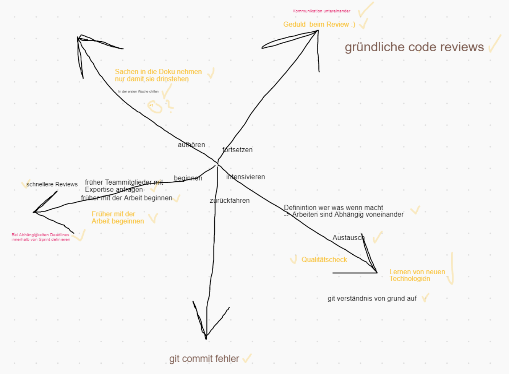
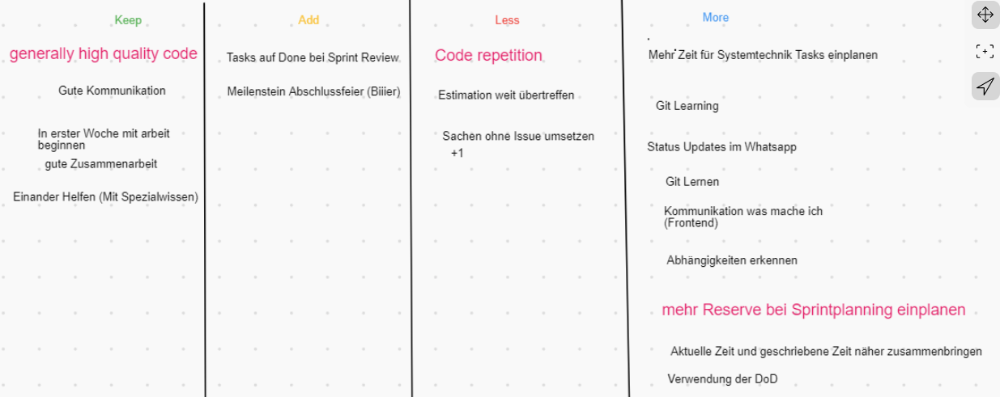

# Schlussbericht

## Einführung

### Zweck

Dieses Dokument fasst unsere Erfahrungen und Ergebnisse des Projektes CapWatch zusammen.

### Gültigkeitsbereich

Dieses Dokument ist gültig für das Engineering Projekt CapWatch, welches im Frühlingssemester 2021 an der Fachhochschule OST Rapperswil-Jona durchgeführt wurde. Es ist für die Betreuer und Entwickler des Projekts ausgelegt.

## Zielerreichung

Durch das Erreichen aller Minimalanforderungen, konnten wir das Projekt erfolgreich abschliessen. Da unser Fokus auf Qualität gerichtet war, lag es nicht mehr in der Zeit, optionale Anforderungen vollständig umzusetzen. Sofern man eine Geschäftsstelle findet, welche Daten anliefert, kann man die Informationen über CapWatch abfragen. Das Design sieht sehr ansprechend aus, sowohl auf Mobile, wie auch auf Desktopsystemen. Durch die gute Softwarearchitektur und vielen qualitätssichernden Massnahmen erreichten wir eine qualitativ sehr hochwertige Software.

## Allgemeiner Erfahrungsbericht

### Projektmanagement

Die Verwendung von SCRUM hat uns im Entwicklungsprozess ideal unterstützt. Unsere Schätzgenauigkeit war bei unseren zweiwöchigen Sprints, schon von Beginn weg, erstaunlich genau. Wir haben jeweils pro Sprint ein Backlog Refinement, Sprint Planning, Sprint Review und als Abschluss eine Sprint Retrospektive durchgeführt. Auf die Daily Standup Meetings haben wir verzichtet, weil es für uns nicht möglich war mit unserem Teilzeitpensum einen täglichen Termin einzuplanen.\
Die Abhängigkeiten von einzelnen Tickets wurden von uns oft zu spät erkannt. Deshalb führten wir im Projektverlauf ein zusätzliches Meeting ein, welches wir jeweils am ersten Donnerstag des Sprints durchführten. Bei den Retrospektiven haben wir verschiedene Formen ausprobiert. Diese haben uns geholfen die Problem in der Zusammenarbeit und dem Projektfortschritt früh anzusprechen und so jeden Sprint besser zu werden. Da wir uns nicht physisch treffen konnten, haben wir uns auf einer virtuellen Kollaborationsplattform ausgetauscht. \
Nachfolgend zwei der verschiedenen Formen der Retrospektiven, die wir ausprobiert haben:

#### Seestern

Zu Beginn der Retrospektive zeichnet der Scrum Master einen „Seestern“ an das Whiteboard oder auf den Flipchart.

Die Mitglieder des Scrum-Teams notieren auf Post-its eine Antwort zu jeder der folgenden Fragen:

- Was müssen wir fortsetzen?
- Was müssen wir intensivieren?
- Was müssen wir zurückfahren?
- Womit müssen wir beginnen?
- Womit müssen wir aufhören?

#### K.A.L.M.

K.A.L.M. steht für:

- Keep – Etwas, das vom Team gut gemacht wird und fortgesetzt werden muss
- Add – Eine neue Idee, die der Verbesserung dient
- Less – Etwas, das gegenwärtig gemacht wird, jedoch nicht zum Erreichen des Ziels beiträgt
- More – Etwas, das gegenwärtig gemacht wird und zum Erreichen des Ziels beitragen kann, wenn es intensiviert wird.

Wir hatten die Projektrollen Scrum Master und Product Owner. Unser Scrum Master hat ebenfalls die Rolle des Projektleiters wahrgenommen. Diese zentrale Rolle war sehr wichtig, da sie einerseits die zentrale Ansprechstelle für unser Team war und andererseits den Fortschritt des Sprints genau verfolgte und auf einzelne Teammitglieder zuging, wenn noch nicht so viel umgesetzt worden war. Zusätzlich moderierte er die Meetings und schaute, dass wir keine Zeit verschwenden. Dadurch konnten wir den Umfang des Sprints bis auf kleine Ausnahmen jeweils umsetzen.

Unsere teaminterne Dokumentation wurde in OneNote geführt. In den Meeting Protokollen wurden Entscheidungen und Besprechungsdetails festgehalten. Zusätzlich sind hier unsere Definition of Done, ausführlichen Richtlinien und Links strukturiert abgelegt.

Wir verwendeten die Kommunikationskanäle WhatsApp und Microsoft Teams. Ankündigungen und Informationen wurden über unseren WhatsApp Chat kommuniziert. Für Meetings und bilaterale Besprechungen trafen wir uns auf Teams. Zu Beginn hatte der Informationsfluss zwischen den Teammitgliedern noch Verbesserungspotential. Durch die Rückmeldungen aus den Retrospektiven konnten wir die Kommunikation jedoch fortlaufend verbessern.

Wir haben am Anfang GitLab als Ticket System und für die Zeiterfassung benutzt. Verschiedene Gründe, welche wir im Dokument [Projektplan](../projektplan/projektplan.md) genauer beschrieben haben, bewogen uns zur Umstellung auf YouTrack. GitLab verwendeten wir nur noch für die Quellcode Verwaltung, Generierung der Dokumente und Container über die Pipeline. Die Verfügbarkeit von GitLab und der Pipeline liess sehr zu wünschen übrig und legte uns einige Steine in den Weg zum absoluten Projekterfolg. Dies war zeitweise sehr frustrierend, sodass wir auch hier analyisierten , die Plattform komplett zu wechseln.

### Dokumentation

Die Dokumentationsvorlage war für uns zuerst irreführend. Wir hatten es so verstanden, dass man für alle aufgeführten Vorgaben etwas dokumentieren muss. Viele Vorgaben in der Vorlage brachten für die Grösse unseres Projektes keinen Mehrwert. Trotzdem dokumentierten wir zu Beginn für alle Vorgaben. Diese Teile der Dokumentation wurden aber zu einem späteren Zeitpunkt wieder entfernt und dadurch wurde unsere Zeit nicht effizient genutzt.

Da Markdown-Tabellen nicht korrekt zu PDF konvertiert werden können, mussten alle Markdown-Tabellen in Restructured Text-Tabellen umgewandelt werden. Dies hat uns auch wieder viel Zeit gekostet und machte das Bearbeiten von Tabellen bemerkbar aufwendiger.

Die Checklisten sind nicht mehr marktorientiert bzw. zeitgemäss und brauchen eine Überarbeitung. Gerade das Definieren von fully dressed Use Cases ist für kleinere Projekte viel zu aufwendig und bringt keinen sichtlichen Mehrwert. In der Anleitung des EPJ Handbooks waren wichtige Details nicht korrekt, was uns mehrere Stunden an Aufwand beschert hat mit fruchtlosen Fehlersuchen, welche mit einer korrekten Anleitung nicht angefallen wären.

Es war vor allem zu Beginn schwierig, die Arbeit aufzuteilen, da alle an den gleichen zwei Dokumenten arbeiten mussten. Dieses Problem hat sich später gemindert, da wir mehr unterschiedliche Arbeiten hatten.

### Entwicklung

Der Einsatz von Lintern, Formattern und Coding Conventions hat sich sehr bewährt und konnte eine konstant hohe Codequalität sicherstellen. Von den Werkzeugen, die Git zur Verfügung stellt, haben wir regen Gebrauch gemacht. Wir haben mit Git Flow, Branching, Conventional Commits und anschliessenden Merge Requests eine gute Struktur erstellt, in welcher Code Reviews eine zentrale Rolle spielten. Im Frontend wurden sogar die Commit Messages geprüft und Commits nur bei keinen Errors vom Linting erlaubt.\
Allgemein lief die Entwicklung im Backend relativ flüssig, da schon viel Wissen vorhanden war. Mit MongoDB und C# gab es zu Beginn ein paar Hürden.\
Die SonarQube Konfiguration war mit .Net um einiges komplizierter als mit Node.js. Im Frontend war am Anfang noch nicht so viel Wissen vorhanden. Dadurch musste vieles im Pairprogramming entwickelt werden und weitere Zeit ausserhalb des Projektes für den Wissensaufbau aufgewendet werden. Dies hat einige Issues weit über die geschätzte Zeit gebracht. Dies wurde im Verlauf des Projektes jedoch auch besser, nachdem wir uns mehr Wissen und Erfahrung angeeignet hatten.

### DevOps

Der Einsatz der GitLab Pipelines für CI/CD hat sich gut bewährt und die Produktivität des Teams spürbar erhöht, da sich die einzelnen Teammitglieder ganz auf das entwickeln von Software konzentrieren konnten und sich nicht um das bauen und integrieren des neuen Codes sorgen mussten. Der Einsatz von SonarQube in der Pipeline hat uns ausserdem stets mit aktuellen Codequalitäts-Metriken versorgt und die Qualität des Codes insgesamt nochmals weiter verbessert.\
Im Backend wurden die geschriebenen Unit Tests durch die Pipelinies ausgeführt und ein Merge eines Feature-Branches in den Develop-Branch konnte nur vorgenommen werden, wenn die Unit Tests erfolgreich ausgeführt werden konnten und die SonarQube Metriken erfüllt wurden.

Es gab aber auch Probleme im DevOps Bereich, vor allem mit der Infrastruktur (siehe unten) und dem CI/CD Teil. Das Thema Continuous Deployment konnten wir am Ende leider gar nicht mehr umsetzen, da die Infrastruktur in der letzten Projektphase sehr häufig nicht erreichbar und generell sehr langsam war. Da die OST IT uns ausserdem von den GitLab Runners her keinen Zugriff via SSH (Port 22) auf unseren Deploymentserver geben wollte, hätten wir aber ohnehin kein vollständiges CD implementieren können in hoher Qualität.

### Pipeline und Infrastruktur

Die von der OST zur Verfügung gestellte Infrastruktur war oft von Problemen und Ausfällen betroffen. Dies war vor allem in den letzten Wochen des Projekts immer häufiger ein Problem. Diese Schwierigkeiten haben zum Teil starke Verzögerungen verursacht und am Ende haben sie dann auch dazu geführt, dass wir das Deployment auf unseren Server nicht korrekt fertigstellen konnten. Wir mussten schliesslich ein manuelles lokales Deployment vornehmen, um das Projektdeployment demonstrieren zu können.

Die Pipeline selber war generell langsam und eher schwerfällig. Vermutlich lag das daran, dass allen Projekten zusammen nur ein einzelner GitLab Runner zugeteilt war. Leider konnten wir das nicht weiter beeinflussen. Es hat aber dazu geführt, dass wir bei der Arbeit oft unnötig ausgebremst wurden, weil lange Wartezeiten entstanden.

## Persönliche Erfahrungen

### Pascal Schlumpf

Für mich war das Projekt sehr lehrreich, da ich das erste Mal ein Projekt von Anfang bis Ende durchgeführt habe. Auch kam ich in Kontakt mit neuen Technologien, Methoden und Arbeitsweisen, die ich so in meinem Arbeitsalltag noch nie verwendet hatte. Ich brauchte am Anfang eine Weile, bis ich die MongoDB in C# integriert hatte. Als dies dann funktionierte, setzte ich auch andere Bereiche im Backend um. Am Ende konnte ich auch noch ein paar Aufträge im Frontend umsetzen, so dass ich alles einmal gesehen habe. Meine Rolle als Product Owner war für mich zu Beginn sehr ungewohnt und ich hatte auch nicht wirklich eine Wahl, was das Bestimmen der umzusetzenden Tasks anging. Es war auch schwierig alle nötigen Issues zu erfassen, da nicht alle Anforderungen über die Checkliste und die Vorlage abgedeckt waren. Für mich als Berufsbegleitender Student war die zusätzliche Belastung durch das EPJ Projekt sehr gross, so dass ich für viele Module nur das Nötigste tun konnte. Nichts desto trotz verlief das Projekt erfolgreich und es war eine grosse Teamleistung.

### Christoph Scheiwiller

Das EPJ war für mich eine super Erfahrung. Da das Projekt auf einer grünen Wiese startete, konnten wir interessante Technologien und moderne Tools einsetzen, welche uns ideal im Entwicklungsprozess unterstützten.
Da ich in meiner täglichen Arbeit SVN verwende, kämpfte ich am Anfang stark mit der Verwendung von GitLab, GitFlow und Conventional Commits. Auch wenn ich diese Tools und Prozesse noch nicht vollständig beherrsche sehe ich viele Vorteile und möchte Git weiterhin verwenden.
Gefordert war ich bei der Entwicklung des Frontends, da ich React noch nicht kannte. Das React Framework ist sehr umfangreich und fordert deshalb eine längere Einarbeitungszeit.
Im Team hatten wir eine gute Zusammenarbeit, damit konnten wir jede Herausforderung gemeinsam meistern. Dabei halfen uns auch unsere Berufserfahrung und Interessen in verschiedenen Fachbereichen, mit welchen wir uns ideal ergänzten.
Als Verantwortlicher für die Code Qualität war ich nicht sehr gefordert, da sich alle Teammitglieder an die vereinbarten Richtlinien hielten. Viele Unschönheiten wurden bereits durch die eingesetzten Tools und den Reviewprozess erkannt und behoben.
Insgesamt ziehe ich für mich ein positives Feedback und kann viele Erfahrungen für die Studienarbeit und die Bachelor-Arbeit mitnehmen.

### Rafael Fuhrer

Das Engineering Projekt war für mich eine besondere Herausforderung. Ich habe bis zu diesem Projekt, trotz Berufstätigkeit neben dem Studium, nie an einem richtigen Softwareprojekt mitgearbeitet. Entsprechend gab es hier für mich viel zu lernen. Vor allem was die Themen Git, Git flow, Clean Code, Best Practices und Debugging angeht, habe ich in den letzten 3 Monaten sehr viel dazu gelernt. Ich durfte aber auch Aufgaben übernehmen, in denen ich um einiges routinierter bin, wie z.B. das Schreiben von Docker & Docker-Compose Files und das Setup der CI-Pipelines. Leider waren diese Tasks in diesem Projekt mit vielen Schwierigkeiten verbunden. Dies lag vor allem an der unzuverlässigen Infrastruktur und den Vorlagen, die uns die OST bereitstellte. Aber auch der Einsatz von C# im Zusammenhang mit Open Source Tools wie SonarQube und Renovate war am Ende eine grössere Herausforderung als ich ursprünglich gedacht hätte. Das Projekt hat mir aber trotzdem meistens viel Spass gemacht, da ich all diese interessanten neuen Dinge gelernt habe, die ich später sicher einmal gebrauchen kann. Alles in allem bin ich sehr froh, dass wir trotz all dieser Probleme unsere Projektziele erreicht und das Projekt erfolgreich abgeschlossen haben.

### Jonas Hauser

Ich habe mich persönlich sehr gefreut, dass ich bei der ersten grösseren Gruppenarbeit an der OST direkt die Funktion als Projektleiter und Scrum Master übernehmen durfte. Meine Passion ist es, Projekte zu organisieren und zu leiten und darum habe ich sehr viel Engagement und Erfahrungen in das Engineering Projekt gesteckt. Dies hat sich soweit wir als Team das beurteilen können, sehr gelohnt. Jeder Sprint ist nahezu problemlos von statten gegangen und die Resultate sind allesamt auf sehr hohem Niveau und im Vergleich zu Projekten auf dem Markt wahrscheinlich überdurchschnittlich.
 Dennoch gab es einige Schwierigkeiten zu meistern. Mitunter einer der grössten Dorne im Auge war der stetige Zeitdruck, ausgelöst durch die sehr kurze Zeitspanne, in der am Projekt gearbeitet werden sollte. Viel Zeit wurde für die Dokumentation, dem allgemeinen Projektmanagement und der mangelnden Infrastruktur der OST aufgewendet, wodurch ich immer versucht habe, quantitativ voranzukommen, aber dennoch in möglichst hoher Qualität.
 Mir hat das Projekt viel Freude bereitet und ich habe persönlich viele praktische Erfahrungen dabei sammeln können.

### Pascal Schneider

Das Engineering Projekt war eine interessante Erfahrung. Neben Arbeit, restlichem Studium und sonstigen Verpflichtungen war es aber zeitweise auch sehr anstrengend.
Die Zusammenarbeit im Team hat zwischenmenschlich sehr gut funktioniert und die Sitzungen waren immer sehr positiv und motivierend.
Einen negativen Nachgeschmack hinterlassen hat hingegen die Infrastruktur der OST, welche uns des Öfteren Probleme bereitet hat. Die Unzulänglichkeiten von GitLab bezüglich Issue Tracking und Zeiterfassung konnten wir glücklicherweise früh mit YouTrack umgehen, die mangelnde Qualität / Anzahl GitLab Runner welche vor allem gegen Ende des Projekts bemerkbar wurde kostete hingegen sehr viel Zeit und Nerven.
Im Backend war für mich vor allem das Implementieren der hexagonalen Architektur spannend, auch wenn diese für unseren Projektumfang etwas übertrieben ist. Auf der negativen Seite ist das Zusammenspiel zwischen .NET und den open-source Werkzeugen, welche wir eingesetzt haben, aufgefallen. Da wir auf der Arbeit Team Foundation Server im Einsatz haben war mir nicht bewusst wie viele Stolpersteine hier existieren und wie oft .NET anders integriert werden muss als andere Technologien. Für zukünftige Projekte nehme ich definitive mit, dass ich bei der Auswahl von Tools besser recherchieren muss, wie gut sich diese mit .NET integrieren lassen.
Alles in Allem war das EPJ ein lehrreiches Projekt mit positiven und negativen Höhepunkten.
